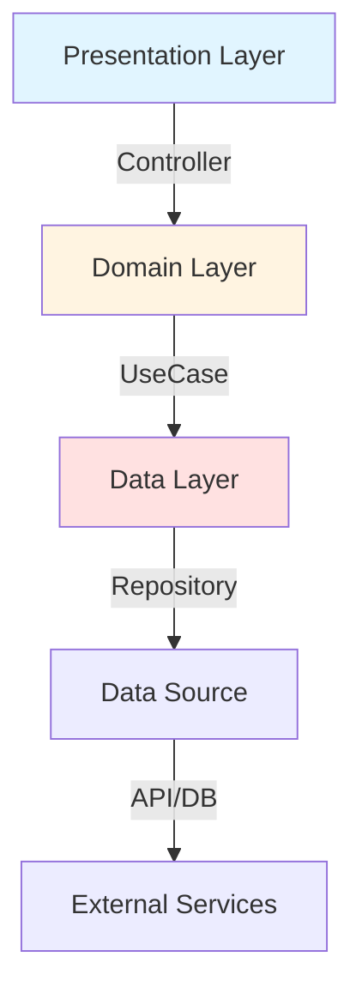

# 💊 PillSnap Mobile

<div align="center">


**카메라 이미징을 통한 AI 기반 의약품 식별 모바일 애플리케이션**

[Features](#-주요-기능) • [Tech Stack](#-기술-스택) • [Getting Started](#-getting-started) • [Documentation](#-documentation) • [Progress](#-project-progress)

</div>

## 📊 Project Dashboard

| Category | Feature | Status | Progress | Notes |
|----------|---------|--------|----------|-------|
| **Authentication** | 이메일 인증 | ✅ Complete |  | Supabase Auth |
| **Onboarding** | 3단계 온보딩 | ✅ Complete |  | PageView |
| **Camera** | 카메라 촬영 | ✅ Complete |  | 줌, 포커스, 플래시 |
| **Image Processing** | 전처리 파이프라인 | ✅ Complete |  | Isolate 기반 |
| **API Integration** | 이미지 분석 API | ✅ Complete |  | /v1/analyze |
| **Results** | 검색 결과 표시 | ✅ Complete |  | Top-3 결과 |
| **Drug Detail** | 약품 상세 정보 | ✅ Complete |  | 4탭 구조 |
| **Narrow Mode** | 100개 약품 모드 | 🔜 Planned |  | BFF 연동 대기 |
| **Settings** | 앱 설정 | 🔜 Planned |  | - |
| **Overall** | **전체 진행률** | **92%** |  | **Production Ready** |

## 🎯 프로젝트 개요

PillSnap은 **카메라로 촬영한 알약 이미지를 AI로 분석**하여 의약품 정보를 제공하는 Flutter 모바일 애플리케이션입니다.

### 핵심 가치
- 📸 **간편한 촬영**: 카메라로 찍기만 하면 끝
- 🤖 **AI 분석**: 4,523개 → 100개 Narrow Mode 지원 (95% 정확도)
- 📚 **상세 정보**: 성분, 효능, 용법, 주의사항 제공
- 🔒 **개인정보 보호**: 의료 데이터 보안 최우선

## ✨ 주요 기능

### 1. 카메라 촬영 📸
- **단일/다중 모드**: 1개 또는 여러 약품 동시 촬영
- **줌 컨트롤**: 1x, 2x, 3x 배율 (하단 컨트롤)
- **탭 포커스**: 화면 터치로 포커스/노출 조절
- **플래시 토글**: 어두운 환경 지원
- **갤러리 선택**: 기존 사진 불러오기
- **iOS 최적화**: 근접 촬영을 위한 1.1x 미세 줌

### 2. 이미지 분석 🔍
- **AI 추론**: EfficientNetV2-S 백본 기반 분류
- **실시간 전처리**: Isolate 기반 비동기 처리
- **고품질 업로드**: 2048px, JPEG Q95
- **식별 정보 입력**: 마크, 색상, 모양 추가 입력으로 정확도 향상

### 3. 결과 표시 📊
- **Top-3 결과**: 정확도 순 상위 3개
- **신뢰도 표시**: 확률값 % 표시
- **약품 상세**: 4개 탭 (성분, 효능, 용법, 주의사항)
- **이미지 확대**: 약품 이미지 모달 뷰

### 4. 사용자 관리 🔐
- **이메일 인증**: Supabase Auth 기반
- **프로필 관리**: 사용자 정보 수정
- **촬영 기록**: 최근 분석 내역

## 🛠 기술 스택

### Core Framework
```yaml
Flutter: 3.8.1+
Dart: 3.0+
Platform: iOS 12.0+ | Android 21+
```

### Architecture
- **Pattern**: Feature-first + Clean Architecture
- **State Management**: Riverpod 2.5.0 (AsyncNotifier)
- **Routing**: go_router 14.0.0 (ShellRoute)
- **Dependency Injection**: Riverpod Provider

### Key Packages
| Category | Package | Version | Purpose |
|----------|---------|---------|---------|
| **Camera** | `camera` | ^0.11.0 | 카메라 촬영 |
| **Image** | `image` | ^4.2.0 | 이미지 전처리 |
| **Backend** | `supabase_flutter` | ^2.8.0 | 인증, DB, Storage |
| **Network** | `http` | ^1.5.0 | API 통신 |
| **Environment** | `flutter_dotenv` | ^5.1.0 | 환경변수 관리 |
| **Serialization** | `freezed` | ^2.5.0 | 불변 모델 |
| **Serialization** | `json_serializable` | ^6.8.0 | JSON 파싱 |
| **Permission** | `permission_handler` | ^11.3.0 | 카메라 권한 |
| **Localization** | `intl` | ^0.20.0 | 국제화 |
| **UUID** | `uuid` | ^4.5.1 | 추적 ID 생성 |

## 🚀 Getting Started

### Prerequisites
- Flutter SDK 3.8.1 이상
- Xcode 14+ (iOS 개발)
- Android Studio (Android 개발)
- Supabase 프로젝트
- PillSnap BFF API 접근 권한

### Installation

```bash
# 1. Clone repository
git clone https://github.com/helious23/pillsnap_mobile.git
cd pillsnap_mobile

# 2. Install dependencies
flutter pub get

# 3. Setup environment variables
cp .env.example .env
# .env 파일 편집 (API 키, Supabase 정보 입력)

# 4. Run code generation
flutter pub run build_runner build --delete-conflicting-outputs

# 5. Run app
flutter run
```

### Environment Setup

`.env` 파일 생성:
```env
# PillSnap API Configuration
API_URL=https://api.pillsnap.co.kr
API_KEY=your_api_key_here

# Supabase
SUPABASE_PROJECT_URL=https://your-project.supabase.co
SUPABASE_ANON_KEY=your_anon_key_here

# Development
DEBUG=true
```

⚠️ **중요**: `.env` 파일은 gitignore에 포함되어 있습니다. 절대 커밋하지 마세요!

### Development Workflow

```bash
# 디버그 모드 실행 (VSCode/Cursor)
F5 또는 Run > Start Debugging

# 특정 플랫폼 실행
flutter run -d ios          # iOS
flutter run -d android      # Android

# Hot Reload
r (콘솔에서)

# Hot Restart
R (콘솔에서)

# 코드 생성 (Freezed, Riverpod)
flutter pub run build_runner watch

# 코드 분석
flutter analyze

# 테스트 실행
flutter test
```

## 📐 아키텍처

### Feature-First Structure

```
lib/
├── core/                      # 전역 공통
│   ├── config/               # 환경 설정
│   ├── network/              # API 클라이언트
│   ├── router/               # 라우팅
│   ├── services/             # Supabase 등
│   ├── utils/                # 유틸리티
│   └── widgets/              # 공통 위젯
├── features/                 # 기능별 모듈
│   ├── auth/                 # 인증
│   │   ├── data/            # Repository 구현
│   │   ├── domain/          # Entity, UseCase
│   │   └── presentation/    # Page, Widget, Controller
│   ├── onboarding/          # 온보딩
│   ├── camera/              # 카메라
│   ├── drug/                # 약품 정보
│   └── settings/            # 설정
└── theme/                    # 디자인 토큰
```

### Clean Architecture Layers



- **Presentation**: UI, Widget, Controller (Riverpod)
- **Domain**: Entity, Repository Interface, UseCase
- **Data**: Repository Implementation, DataSource, Model

### State Management (Riverpod)

```dart
// AsyncNotifier 패턴
@riverpod
class Camera extends _$Camera {
  @override
  Future<CameraState> build() async {
    return await _initializeCamera();
  }

  Future<void> takePicture() async {
    state = const AsyncValue.loading();
    state = await AsyncValue.guard(() async {
      final image = await _captureImage();
      return state.value!.copyWith(capturedImage: image);
    });
  }
}
```

## 📸 이미지 전처리 파이프라인

### 프론트엔드 책임 (Flutter)

```
원본 이미지 (4032x3024, 5MB)
    ↓
1. EXIF 방향 반영 (bakeOrientation)
2. SHA256 해시 계산
3. 비율 유지 다운스케일 (목표: 2048px)
4. JPEG Q95 재인코딩 (메타데이터 제거)
5. /tmp/upload_ready_*.jpg 저장
    ↓
최종 이미지 (2048x1536, 800KB)
    ↓
API 업로드 (Multipart)
```

### 전처리 규격 (UploadImageSpec)

| 항목 | 값 | 설명 |
|------|-----|------|
| **minLongEdge** | 1024px | 최소 해상도 |
| **targetLongEdge** | 2048px | 목표 해상도 |
| **maxLongEdge** | 4096px | 최대 해상도 |
| **jpegQuality** | 95 | JPEG 품질 |
| **maxFileSize** | 10MB | 최대 파일 크기 |

### Isolate 기반 비동기 처리

```dart
// 메인 스레드 차단 방지
Future<ProcessedImageResult> preprocessImage(String path) async {
  return await compute(_processImageInIsolate, params);
}

// Isolate에서 실행
Future<ProcessedImageResult> _processImageInIsolate(params) async {
  // 1. 파일 읽기 & 디코드
  // 2. EXIF 회전 반영
  // 3. 리사이징 (cubic 보간)
  // 4. JPEG Q95 인코딩
  // 5. 메타데이터 반환
}
```

**성능 측정** (iPhone 12 Pro 기준):
- 4000x3000 → 2048x1536: ~1.2초
- 메모리 사용: 150MB 이하
- UI 블로킹: 0ms

## 🔌 API Integration

### Endpoints

| Method | Endpoint | Purpose | Status |
|--------|----------|---------|--------|
| **POST** | `/v1/analyze` | 이미지 분석 (단일/다중) | ✅ 구현 |
| **GET** | `/v1/drugs/item/{id}` | 약품 상세 정보 | ✅ 구현 |
| **POST** | `/v1/drugs/batch` | 다중 약품 정보 | ✅ 구현 |
| **POST** | `/v1/narrow/analyze` | Narrow Mode 분석 | 🔜 예정 |
| **GET** | `/v1/narrow/kcodes` | K-CODE 목록 | 🔜 예정 |
| **GET** | `/health` | 헬스체크 | ✅ 구현 |

### Request Example

```dart
// POST /v1/analyze
final result = await apiClient.analyzeImage(
  imageFile,
  mode: 'cls_only',  // 'cls_only' | 'detect_cls'
  roiFile: roiFile,  // optional
  identificationData: {
    'text': ['TYLENOL', '500'],
    'colors': ['하양'],
    'shape': '원형',
    'size': '중간',
    'hasScoreLine': false,
    'hasCoating': true,
  },
);
```

### Response Example

```json
{
  "inference": {
    "dets": [{
      "top1": {
        "prob": 0.92,
        "label": {
          "item_seq": 198801518,
          "name_kr": "타이레놀정500",
          "manufacturer": "한국얀센",
          "drug_shape": "원형",
          "drug_color_front": "하양",
          "item_image": "https://..."
        }
      },
      "top3": [...]
    }]
  }
}
```

## 🧪 Testing

### Unit Tests

```bash
flutter test test/unit/
```

**커버리지 목표**: 80% 이상

### Widget Tests

```bash
flutter test test/widget/
```

### Integration Tests

```bash
flutter test integration_test/
```

## 📝 Documentation

| Document | Description | Link |
|----------|-------------|------|
| **API Integration Plan** | BFF API 통합 계획 | [📄 View](./docs/2025-10-27_bff_api_integration_plan.md) |
| **Architecture Guide** | 아키텍처 상세 설명 | [📄 View](./docs/ARCHITECTURE.md) |
| **API Integration** | API 통합 가이드 | [📄 View](./docs/API_INTEGRATION.md) |
| **Image Preprocessing** | 이미지 전처리 파이프라인 | [📄 View](./docs/IMAGE_PREPROCESSING_PIPELINE.md) |
| **Image Optimization** | 이미지 최적화 가이드 | [📄 View](./docs/IMAGE_OPTIMIZATION_GUIDE.md) |
| **Camera Modifications** | 카메라 기능 변경 로그 | [📄 View](./docs/camera_modifications_log.md) |

## 📈 Project Progress

### Completed Features ✅

- [x] 인증 시스템 (Supabase Auth)
  - [x] 이메일 회원가입
  - [x] 이메일 인증
  - [x] 로그인/로그아웃
  - [x] 프로필 관리
- [x] 온보딩 (3단계 PageView)
- [x] 카메라 기능
  - [x] 단일/다중 모드
  - [x] 줌 컨트롤 (1x/2x/3x)
  - [x] 탭 포커스/노출
  - [x] 플래시 토글
  - [x] 갤러리 선택
  - [x] iOS 근접 촬영 최적화
- [x] 이미지 전처리
  - [x] EXIF 방향 반영
  - [x] 비율 유지 리사이징
  - [x] JPEG Q95 인코딩
  - [x] Isolate 기반 비동기 처리
  - [x] 구조화된 로깅
- [x] API 통합
  - [x] POST /v1/analyze
  - [x] GET /v1/drugs/item/{id}
  - [x] POST /v1/drugs/batch
- [x] 약품 결과 표시
  - [x] Top-3 결과 카드
  - [x] 정확도 표시
  - [x] 약품 상세 페이지 (4탭)
- [x] 환경변수 관리
  - [x] flutter_dotenv 통합
  - [x] .env 파일 기반

### In Progress 🚧

- [ ] BFF API 통합 준비
  - [ ] API 응답 파싱 테스트
  - [ ] 네트워크 에러 처리 강화
  - [ ] 재시도 로직

### Planned 🔜

- [ ] Narrow Mode (100개 약품)
  - [ ] POST /v1/narrow/analyze 통합
  - [ ] GET /v1/narrow/kcodes 통합
  - [ ] UI 토글 및 뱃지
- [ ] 설정 페이지
  - [ ] 프로필 수정
  - [ ] 알림 설정
  - [ ] 언어 설정
- [ ] 추가 기능
  - [ ] 복약 알림
  - [ ] 촬영 기록 상세
  - [ ] 즐겨찾기

## 🗓 Milestones

- [x] **M1**: 프로젝트 설정 및 기본 구조 (2025-09-01)
- [x] **M2**: 인증 및 온보딩 완료 (2025-09-02)
- [x] **M3**: 카메라 기능 구현 (2025-09-03)
- [x] **M4**: 이미지 전처리 파이프라인 (2025-09-07)
- [x] **M5**: API 통합 및 결과 표시 (2025-09-10)
- [x] **M6**: 환경변수 마이그레이션 (2025-10-27)
- [ ] **M7**: BFF API 통합 (2025-11-15 예정)
- [ ] **M8**: Narrow Mode 구현 (2025-11-30 예정)
- [ ] **M9**: 프로덕션 배포 (2025-12-31 예정)

## 🔗 관련 프로젝트

- **Narrow Model**: https://github.com/helious23/pillsnap-narrow-model
- **BFF API**: (Private - Linux PC)
- **추론 서버**: https://github.com/helious23/pillsnap-inference-narrow

## 👥 Contributors

- **@helious23** - Lead Developer
- **Claude Code** - Development Assistant

## 📄 License

This project is proprietary and confidential.

## 🆘 Support

Issues & Questions:
- GitHub Issues: https://github.com/helious23/pillsnap_mobile/issues
- Email: max16@naver.com

---

<div align="center">

**[📱 Download App](#)** | **[📚 Documentation](./docs/)** | **[🚀 API Integration Plan](./docs/2025-10-27_bff_api_integration_plan.md)**

*Last Updated: 2025-10-27 KST*

Made with ❤️ by PillSnap Team

</div>
