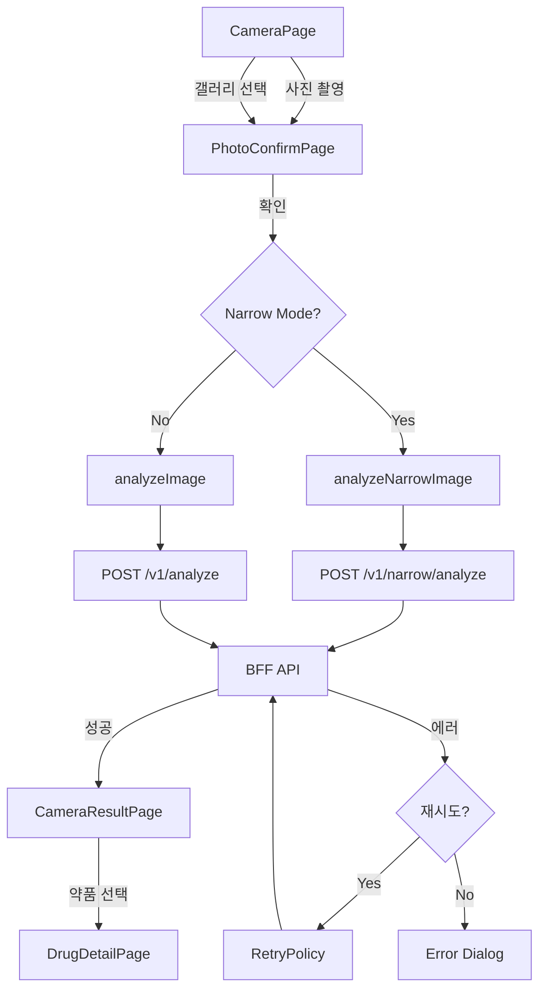
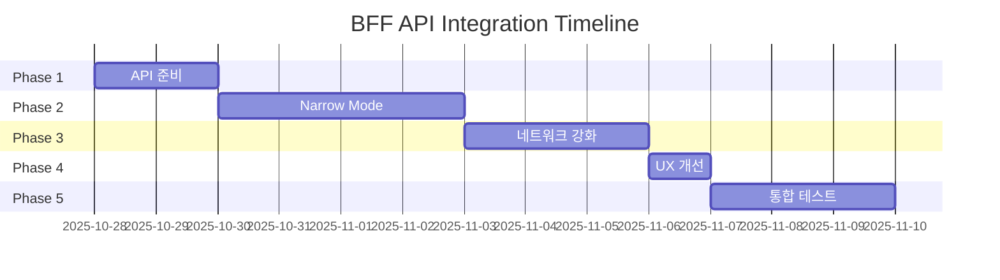

# 🚀 BFF API Integration Plan

<div align="center">


**Flutter 앱이 BFF Docker API와 통합되기 전 준비해야 할 모든 사항**

</div>

## 📊 Integration Dashboard

| Phase | Priority | Progress | ETA | Key Deliverable |
|-------|----------|----------|-----|-----------------|
| **[Phase 1: API 준비](#-phase-1-bff-api-통합-준비-최우선-2-3일)** | 🔥 최우선 |  | 1.5일 | API 파싱 테스트 |
| **[Phase 2: Narrow Mode](#-phase-2-narrow-mode-통합-고우선-3-4일)** | 🚀 고우선 |  | 3.5일 | Narrow 엔드포인트 |
| **[Phase 3: 네트워크 강화](#-phase-3-네트워크-에러-처리-강화-중우선-2-3일)** | 💪 중우선 |  | 2.5일 | 재시도 로직 |
| **[Phase 4: UX 개선](#-phase-4-로딩-상태-및-ux-개선-중우선-1-2일)** | 🎨 중우선 |  | 1일 | 진행률 표시 |
| **[Phase 5: 통합 테스트](#-phase-5-통합-테스트-및-디버깅-필수-2-3일)** | 🧪 필수 |  | 3일 | 테스트 완료 |
| **Total** | | | **~12일** | **Production Ready** |

## 🎯 Current Status

### ✅ Already Implemented (92% Complete)

```
[x] 카메라 기능 - 촬영, 줌, 포커스, 플래시, 갤러리 (95%)
[x] 이미지 전처리 - EXIF 반영, 리사이징, JPEG Q95, Isolate (100%)
[x] API 통합 - POST /v1/analyze, GET /v1/drugs/item/{id} (90%)
[x] 결과 표시 - 검색 결과, 상세 페이지 (95%)
[x] 에러 처리 - 기본 에러 핸들링, 로깅 (85%)
[x] 상태관리 - Riverpod AsyncNotifier 패턴 (100%)
[x] 환경변수 - flutter_dotenv 기반 .env 관리 (100%)
```

### 🔜 Needs Implementation

```
[ ] Narrow Mode 엔드포인트 통합
[ ] 네트워크 재시도 로직
[ ] 연결 상태 체크
[ ] 로딩 진행률 표시
[ ] API 응답 파싱 테스트
[ ] BFF URL 환경변수 전환
```

## 📋 Master TODO List

<details open>
<summary><b>Phase 1: BFF API 통합 준비 [0/3] 🔥 최우선</b></summary>

### 1.1 API 응답 구조 검증 [0/3]
- [ ] BFF 응답 스펙 확인 (성공/실패/에러 예시)
- [ ] 응답 파싱 테스트 케이스 작성 (`test/unit/drug_repository_test.dart`)
- [ ] 필드명 호환성 매핑 강화 (`_safeString()` 헬퍼)

**담당 파일**:
- `lib/features/drug/data/repositories/drug_repository_impl.dart`
- `test/unit/drug_repository_test.dart` (신규)

**예상 시간**: 0.5일

---

### 1.2 환경변수 및 API 설정 [0/3]
- [ ] `.env.example` 파일 생성 (Git 추적용 템플릿)
- [ ] iOS localhost 허용 (`Info.plist` NSAllowsLocalNetworking)
- [ ] Android cleartext 허용 (`AndroidManifest.xml` usesCleartextTraffic)

**담당 파일**:
- `.env.example` (신규)
- `ios/Runner/Info.plist`
- `android/app/src/main/AndroidManifest.xml`

**예상 시간**: 0.5일

---

### 1.3 API 클라이언트 로깅 강화 [0/2]
- [ ] 요청/응답 로깅 강화 (traceId, duration, 크기)
- [ ] 타임아웃 설정 (30초 기본, 60초 업로드)

**담당 파일**:
- `lib/core/network/api_client.dart`

**예상 시간**: 0.5일

</details>

<details>
<summary><b>Phase 2: Narrow Mode 통합 [0/5] 🚀 고우선</b></summary>

### 2.1 Narrow 엔드포인트 추가 [0/2]
- [ ] `analyzeNarrowImage()` 메서드 추가 (POST /v1/narrow/analyze)
- [ ] `getNarrowKCodes()` 메서드 추가 (GET /v1/narrow/kcodes)

**담당 파일**:
- `lib/core/network/api_client.dart`

**예상 시간**: 0.5일

---

### 2.2 Narrow Mode 상태 관리 [0/1]
- [ ] `NarrowModeNotifier` 생성 (enabled, availableKCodes, loading, error)

**담당 파일**:
- `lib/features/drug/presentation/controllers/narrow_mode_controller.dart` (신규)
- `lib/features/drug/domain/entities/narrow_mode_state.dart` (신규, Freezed)

**예상 시간**: 0.5일

---

### 2.3 Home 화면 UI 추가 [0/2]
- [ ] Narrow Mode 토글 스위치
- [ ] K-CODE 목록 다이얼로그

**담당 파일**:
- `lib/features/home/presentation/pages/home_page.dart`

**예상 시간**: 0.5일

---

### 2.4 카메라와 통합 [0/2]
- [ ] `CameraLoadingPage`에서 Narrow Mode 분기
- [ ] Repository에서 API 선택 (`mode: 'narrow'`)

**담당 파일**:
- `lib/features/camera/presentation/pages/camera_loading_page.dart`
- `lib/features/drug/data/repositories/drug_repository_impl.dart`

**예상 시간**: 1일

---

### 2.5 결과 화면 뱃지 [0/1]
- [ ] Narrow Mode 활성화 시 녹색 뱃지 표시

**담당 파일**:
- `lib/features/drug/presentation/pages/camera_result_page.dart`

**예상 시간**: 0.5일

</details>

<details>
<summary><b>Phase 3: 네트워크 에러 처리 강화 [0/3] 💪 중우선</b></summary>

### 3.1 재시도 로직 구현 [0/2]
- [ ] `RetryPolicy` 유틸리티 (Exponential Backoff)
- [ ] API 클라이언트에 적용 (최대 3회 재시도)

**담당 파일**:
- `lib/core/network/retry_policy.dart` (신규)
- `lib/core/network/api_client.dart`

**예상 시간**: 1일

---

### 3.2 연결 상태 체크 [0/3]
- [ ] `connectivity_plus` 패키지 추가
- [ ] `NetworkChecker` 유틸리티 생성
- [ ] 분석 전 연결 체크 및 다이얼로그

**담당 파일**:
- `pubspec.yaml`
- `lib/core/network/network_checker.dart` (신규)
- `lib/features/camera/presentation/pages/camera_loading_page.dart`

**예상 시간**: 1일

---

### 3.3 상세 에러 메시지 [0/2]
- [ ] `ApiException` 커스텀 예외 (타입별 분류)
- [ ] 에러 매핑 및 사용자 친화적 메시지

**담당 파일**:
- `lib/core/network/api_exception.dart` (신규)
- `lib/core/network/api_client.dart`

**예상 시간**: 0.5일

</details>

<details>
<summary><b>Phase 4: 로딩 상태 및 UX 개선 [0/2] 🎨 중우선</b></summary>

### 4.1 진행률 표시 [0/2]
- [ ] 경과 시간 표시 및 단계별 메시지
- [ ] 진행률 바 (시각적 피드백)

**담당 파일**:
- `lib/features/camera/presentation/pages/camera_loading_page.dart`

**예상 시간**: 0.5일

---

### 4.2 취소 버튼 [0/1]
- [ ] 분석 중 취소 기능 (CancelToken)

**담당 파일**:
- `lib/features/camera/presentation/pages/camera_loading_page.dart`

**예상 시간**: 0.5일

</details>

<details>
<summary><b>Phase 5: 통합 테스트 [0/2] 🧪 필수</b></summary>

### 5.1 BFF 연동 테스트 [0/13]
- [ ] 카메라 촬영 → 분석 → 결과 (단일 모드)
- [ ] 카메라 촬영 → 분석 → 결과 (다중 모드)
- [ ] 갤러리 선택 → 분석 → 결과
- [ ] 식별 정보 입력 → 분석
- [ ] Narrow 토글 → 분석 → 뱃지 표시
- [ ] K-CODE 목록 조회
- [ ] 네트워크 없음 → 에러 메시지
- [ ] 타임아웃 → 재시도
- [ ] 서버 500 → 에러 메시지
- [ ] 큰 이미지 (10MB+) → 전처리
- [ ] 작은 이미지 (100KB) → 업스케일 안함
- [ ] 세로 사진 → EXIF 회전
- [ ] 약품 없음 → 결과 없음

**예상 시간**: 2일

---

### 5.2 로그 분석 및 디버깅 [0/1]
- [ ] 네트워크 로그 필터링 및 성능 프로파일링

**도구**:
- Flutter DevTools
- Charles Proxy / Proxyman
- Xcode Instruments

**예상 시간**: 1일

</details>

## 📈 Implementation Progress

### Current Implementation Status

| Category | Feature | Status | Progress | Notes |
|----------|---------|--------|----------|-------|
| **Camera** | 카메라 촬영 | ✅ Complete |  | ROI 로직 TODO |
| **Camera** | 이미지 전처리 | ✅ Complete |  | Isolate 기반 |
| **API** | /v1/analyze | ✅ Complete |  | Multipart 업로드 |
| **API** | /v1/drugs/item | ✅ Complete |  | 상세 정보 조회 |
| **API** | /v1/narrow/analyze | 🔜 Pending |  | Phase 2 |
| **API** | /v1/narrow/kcodes | 🔜 Pending |  | Phase 2 |
| **UI** | 검색 결과 표시 | ✅ Complete |  | - |
| **UI** | 약품 상세 페이지 | ✅ Complete |  | 4개 탭 구조 |
| **UI** | Narrow Mode UI | 🔜 Pending |  | Phase 2 |
| **Error** | 기본 에러 처리 | ✅ Complete |  | - |
| **Error** | 재시도 로직 | 🔜 Pending |  | Phase 3 |
| **Error** | 연결 체크 | 🔜 Pending |  | Phase 3 |

## 🔄 API Integration Flow



## 📝 BFF 개발팀 요청 사항

### 필수 정보

```markdown
### 1. API 엔드포인트 URL
- [ ] 개발 서버: http://192.168.x.x:8000 (또는 localhost)
- [ ] API Key 발급 방법

### 2. 응답 형식 예시 (JSON)
- [ ] POST /v1/analyze (성공)
  ```json
  {
    "inference": {
      "dets": [{
        "top1": {
          "prob": 0.92,
          "label": {
            "item_seq": 198801518,
            "name_kr": "타이레놀정500",
            ...
          }
        },
        "top3": [...]
      }]
    }
  }
  ```
- [ ] POST /v1/analyze (실패 - 약품 없음)
  ```json
  {
    "inference": {
      "dets": []
    }
  }
  ```
- [ ] POST /v1/analyze (에러 - 500)
  ```json
  {
    "error": "Internal server error",
    "message": "Model inference failed"
  }
  ```
- [ ] POST /v1/narrow/analyze (성공)
  ```json
  {
    "narrow_mode": true,
    "total_classes": 4523,
    "filtered_classes": 100,
    "inference": { ... }
  }
  ```
- [ ] GET /v1/narrow/kcodes (성공)
  ```json
  {
    "kcodes": ["A01AA01", "A01AB01", ...]
  }
  ```

### 3. 에러 코드 정의
- [ ] 4xx 클라이언트 에러 목록
- [ ] 5xx 서버 에러 목록
- [ ] 재시도 가능 여부 (어떤 에러에서 재시도해야 하는지)

### 4. 제한 사항
- [ ] 이미지 최대 크기 (현재 10MB)
- [ ] Rate Limit (초당 요청 수)
- [ ] 타임아웃 권장값 (현재 30초)
```

## 🚀 Quick Start: 즉시 시작 가능한 작업

### BFF 대기 중 진행 가능 (우선순위 순)

```bash
# 1. .env.example 파일 생성 (5분)
cat > .env.example << 'EOF'
# PillSnap API Configuration
API_URL=https://api.pillsnap.co.kr
API_KEY=your_api_key_here

# Supabase
SUPABASE_PROJECT_URL=https://your-project.supabase.co
SUPABASE_ANON_KEY=your_anon_key_here

# Development
DEBUG=true
EOF

# 2. RetryPolicy 유틸리티 작성 (1시간)
# lib/core/network/retry_policy.dart

# 3. NetworkChecker 유틸리티 작성 (1시간)
# lib/core/network/network_checker.dart

# 4. ApiException 커스텀 예외 작성 (30분)
# lib/core/network/api_exception.dart

# 5. CameraLoadingPage 진행률 개선 (2시간)
# lib/features/camera/presentation/pages/camera_loading_page.dart

# 6. Narrow Mode 상태 관리 구조 (3시간)
# lib/features/drug/presentation/controllers/narrow_mode_controller.dart

# 7. 테스트 케이스 작성 (하루)
# test/unit/drug_repository_test.dart
```

## 📁 Key Files Reference

### 핵심 수정 대상 파일

```
lib/
├── core/
│   ├── network/
│   │   ├── api_client.dart               # ✅ 구현됨, Narrow 엔드포인트 추가 필요
│   │   ├── retry_policy.dart             # 🔜 신규 작성 필요
│   │   ├── network_checker.dart          # 🔜 신규 작성 필요
│   │   └── api_exception.dart            # 🔜 신규 작성 필요
│   └── config/
│       └── app_config.dart               # ✅ dotenv 기반 완료
├── features/
│   ├── camera/
│   │   └── presentation/
│   │       └── pages/
│   │           └── camera_loading_page.dart  # ⚠️ 수정 필요 (진행률, 재시도)
│   ├── drug/
│   │   ├── data/
│   │   │   └── repositories/
│   │   │       └── drug_repository_impl.dart  # ⚠️ 수정 필요 (Narrow 분기)
│   │   └── presentation/
│   │       ├── controllers/
│   │       │   └── narrow_mode_controller.dart  # 🔜 신규 작성 필요
│   │       └── pages/
│   │           ├── camera_result_page.dart   # ⚠️ 수정 필요 (뱃지)
│   └── home/
│       └── presentation/
│           └── pages/
│               └── home_page.dart             # ⚠️ 수정 필요 (토글 UI)
└── test/
    └── unit/
        └── drug_repository_test.dart         # 🔜 신규 작성 필요

Environment:
├── .env                                      # ✅ 완료 (gitignored)
├── .env.example                              # 🔜 신규 작성 필요
├── ios/Runner/Info.plist                     # ⚠️ 수정 필요 (localhost)
└── android/app/src/main/AndroidManifest.xml  # ⚠️ 수정 필요 (cleartext)
```

**범례**:
- ✅ 완료
- ⚠️ 수정 필요
- 🔜 신규 작성 필요

## 🎯 Success Criteria

### Phase 1 완료 조건
- [ ] API 응답 파싱 테스트 10개 이상 통과
- [ ] .env.example 파일 커밋
- [ ] iOS/Android 네트워크 설정 완료
- [ ] 로깅으로 요청/응답 추적 가능

### Phase 2 완료 조건
- [ ] Narrow Mode 토글 정상 작동
- [ ] K-CODE 목록 조회 성공
- [ ] Narrow API 호출 성공
- [ ] 결과 페이지에 뱃지 표시

### Phase 3 완료 조건
- [ ] 네트워크 끊김 시 재시도 3회
- [ ] 오프라인 상태 감지 및 다이얼로그
- [ ] 타임아웃 에러 적절히 처리
- [ ] 사용자 친화적 에러 메시지

### Phase 4 완료 조건
- [ ] 로딩 진행률 시각적 표시
- [ ] 분석 중 취소 가능
- [ ] 평균 분석 시간 표시

### Phase 5 완료 조건
- [ ] 13개 테스트 시나리오 모두 통과
- [ ] 메모리 누수 없음
- [ ] 평균 응답 시간 10초 이내
- [ ] 크래시 0건

## 🏆 Milestones

- [ ] **M1**: BFF 연동 준비 완료 (3일) - API 파싱, 환경 설정
- [ ] **M2**: Narrow Mode 구현 (6일) - 엔드포인트, UI, 통합
- [ ] **M3**: 안정성 강화 (9일) - 재시도, 연결 체크, 에러 처리
- [ ] **M4**: 프로덕션 준비 (12일) - 테스트, 성능, 디버깅

## 📊 Estimated Timeline



**총 예상 기간**: **12일 (2.5주)**

**시작 가능 시점**: BFF API 정보 수신 즉시

**완료 목표일**: BFF 배포 후 2주 내

## 📝 Related Documents

- **[API Integration Guide](./API_INTEGRATION.md)** - 기존 API 통합 문서
- **[Architecture Guide](./ARCHITECTURE.md)** - 전체 아키텍처
- **[Image Preprocessing](./IMAGE_PREPROCESSING_PIPELINE.md)** - 이미지 전처리 파이프라인
- **[Narrow Model Project](https://github.com/helious23/pillsnap-narrow-model)** - Narrow Mode 배경

## 👥 Contributors

- **@helious23** - Flutter Development
- **Claude Code** - Implementation Planning

---

<div align="center">

**[📋 View Progress](../README.md)** | **[🚀 Start Implementation](#-quick-start-즉시-시작-가능한-작업)** | **[🧪 Test Checklist](#51-bff-연동-테스트-013)**

*Last Updated: 2025-10-27 KST*

</div>
